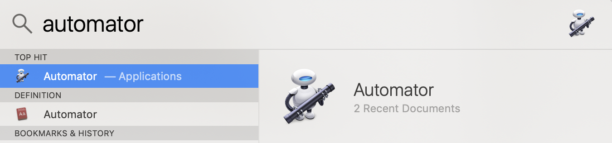
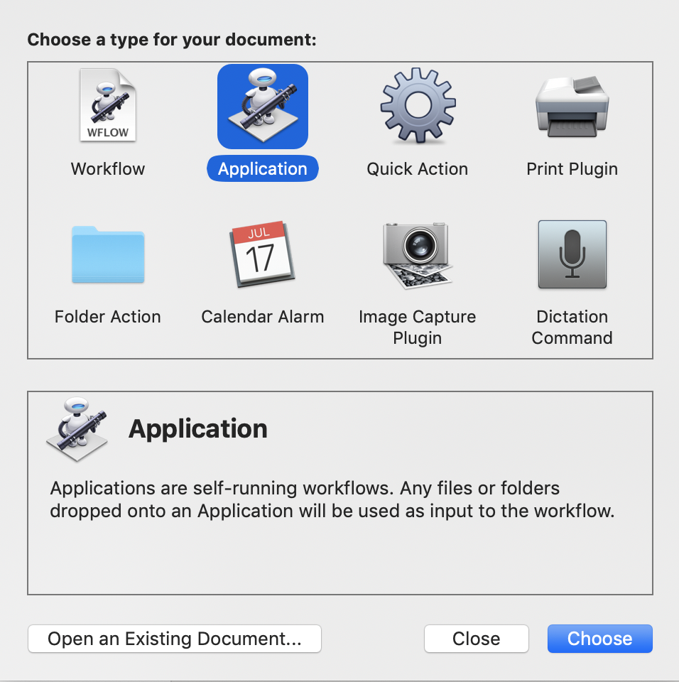
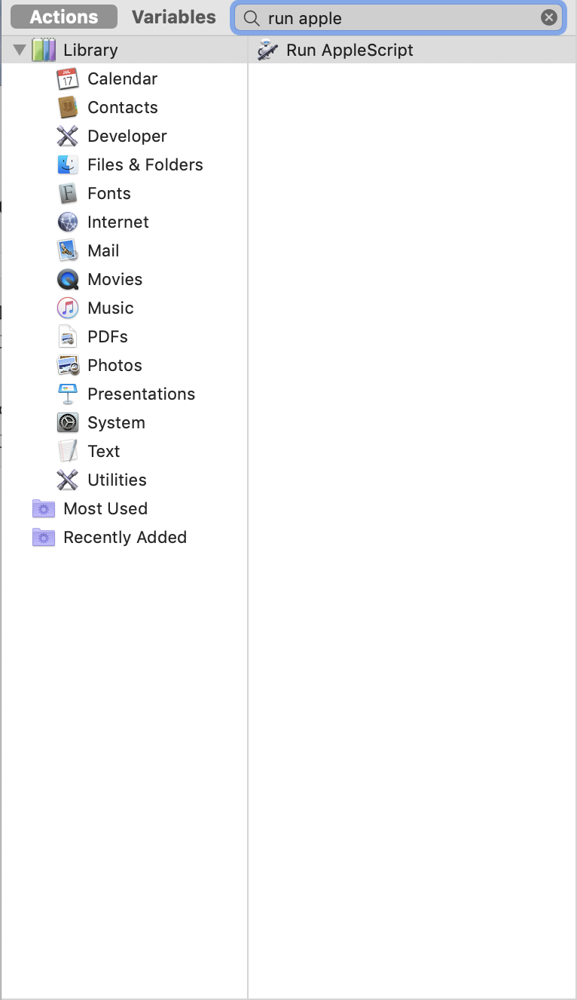
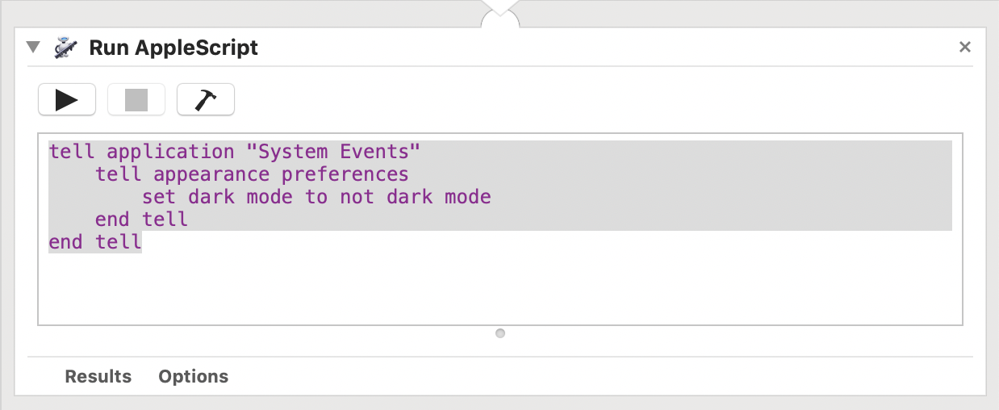
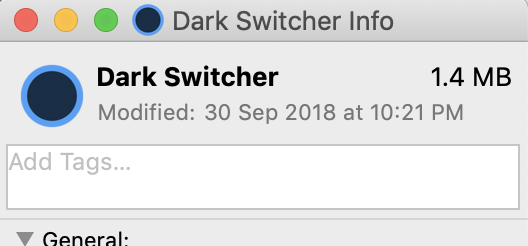
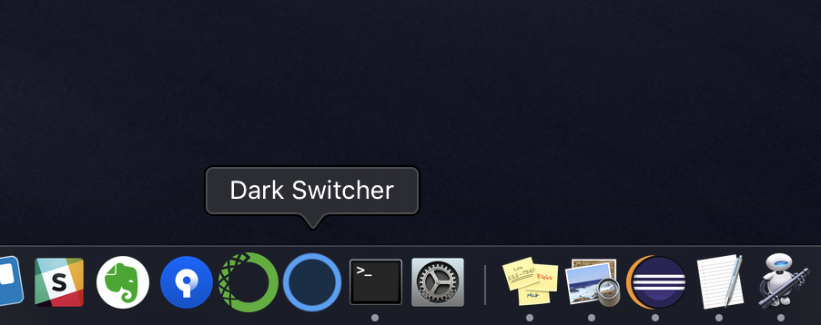

# Dark Mode Switcher

## How to make the Dark Mode Switcher

1. Launch the Automator
2. Choose a type as Application for your documents
3. Find Actions, 'Run AppleScript'
4. Type the AppleScript
5. Save the action in the Application folder

*Optional Steps*:

6. *Add your own icon*
7. *Keep in dock*

### Launch the Automator



### Choose a type for your documents

Choose Application type




### Find Actions

Find Actions 'Run AppleScript'




### Type the script like below



AppleScript Code:

```
tell application "System Events"
	tell appearance preferences
		set dark mode to not dark mode
	end tell
end tell
```

### Add your own Application Icon



### Keep in Dock



---


## Run the Dark Switcher


